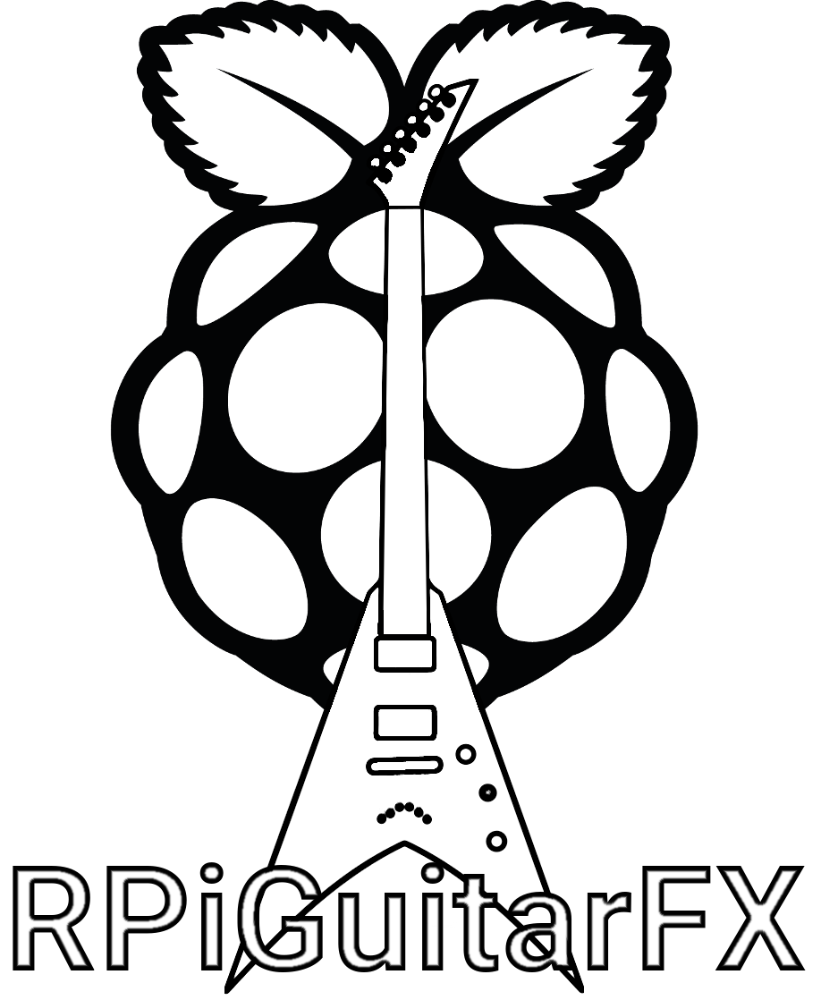

# RPiGuitarFx
It's project of guitar multieffect build with Raspberry Pi with use GTK for gui and Jack for audio.
Orginally it was prepared for my master thesis. Main purpouse of this projekt was implement ceratin DSP algorithms.
I implement:
* delay
* chorus
* flanger
* vibrato
* tonestack (3-band eq from guitar amp)
* simple fuzz / distortion

If you're interested how it works check also http://www.dafx.de/ and http://quitte.de/dsp/caps.html

Also theres's used:
* IIR biquads filter
* delay line
* upsampling/downsampling
* round buffers

Project main problem is stability, ussualy program fails from memory corruption. It happend because there should be applied more multithreads mehanism like mutex, semaphores etc.\ 
It was not oryginally done because raal time situations like audio processing need more attention.
Also GTK is not great when is used with encoders... Probably it should be rewritten in QT.

There's two way of use this multieffect:
1. PC with linux. Use keyboard to manipulate effects (how? see pictures bellow)
2. On Raspberry Pi, but you need encoders (see code to get info about pin configutarion)

I use Eclipse CDT to build project on PC, and not preapred any special build files besides this.\
To use with raspberry Pi, copy projekt and use make.

## build
### required libraries/packages
to build:
* jackd2 and libjack-jackd2-dev
* libgtkmm-3.0-dev 
* pkg-config
* wiringpi 
* rotary encoder lib https://github.com/F6HQZ/rotary-encoder-lib-for-raspberry-pi

to use:
* dbusx11
* xorg
* xinit
* openbox 

### build process
At first you need to edit every subdir.mk file to set yuour path.
go to /Debug then:
> make -j4 all

## how to start
* run jack server with your audio device
* start multieffect program

## gui

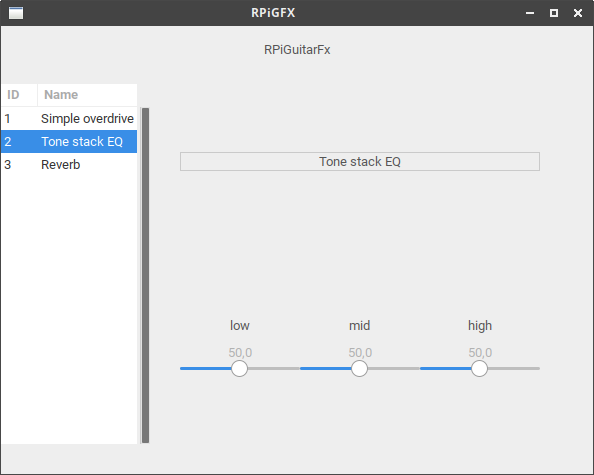
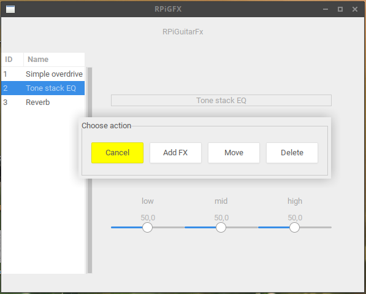
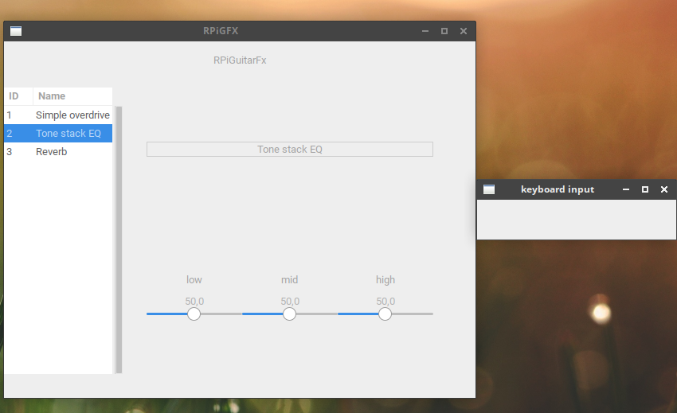

## multieffect pictures

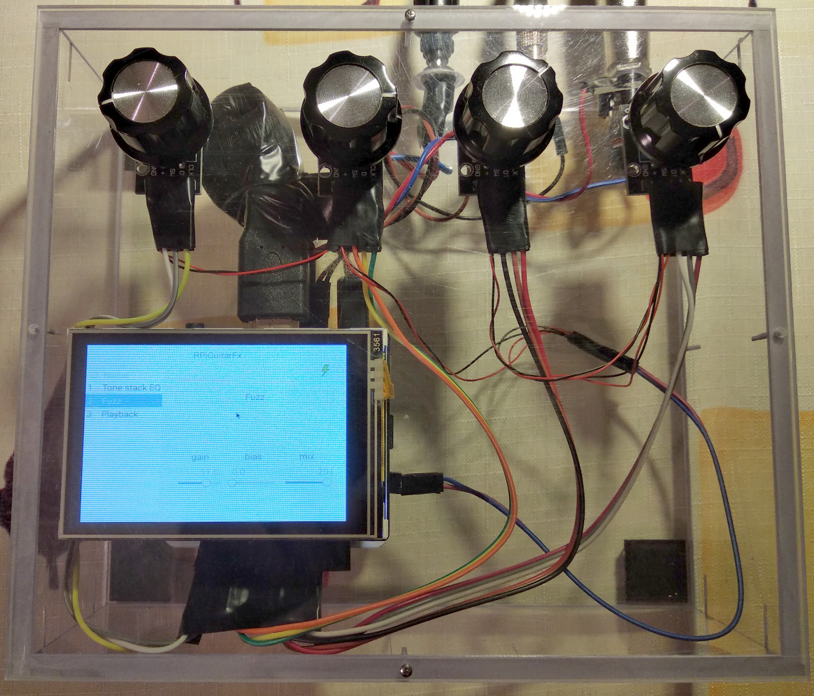
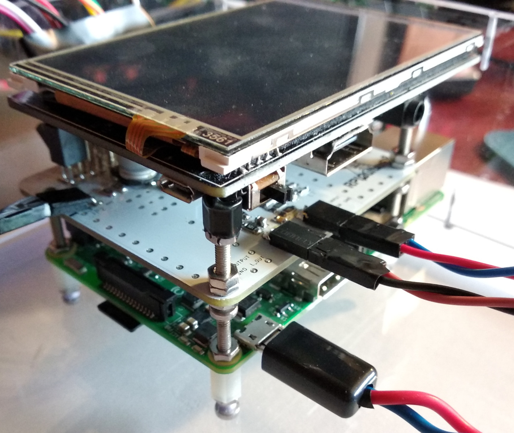
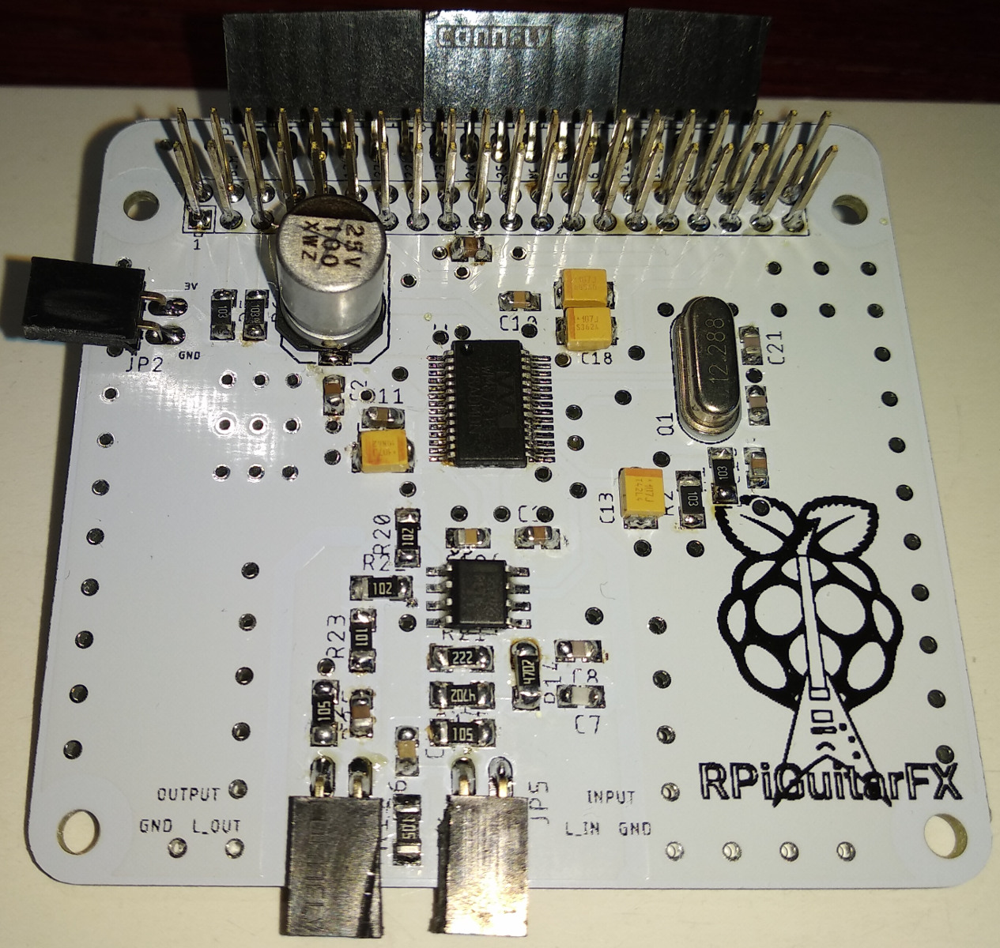

## how it works

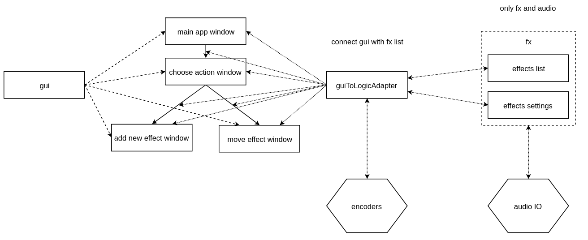
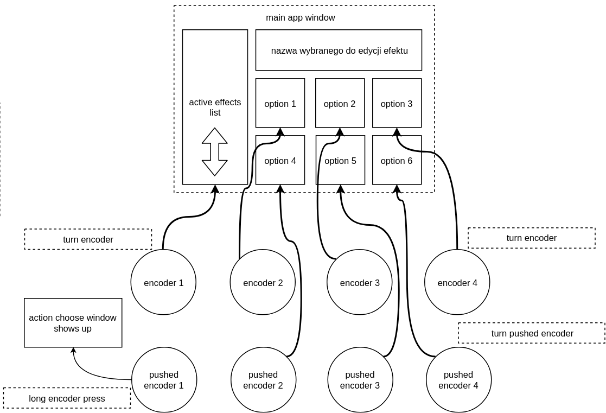
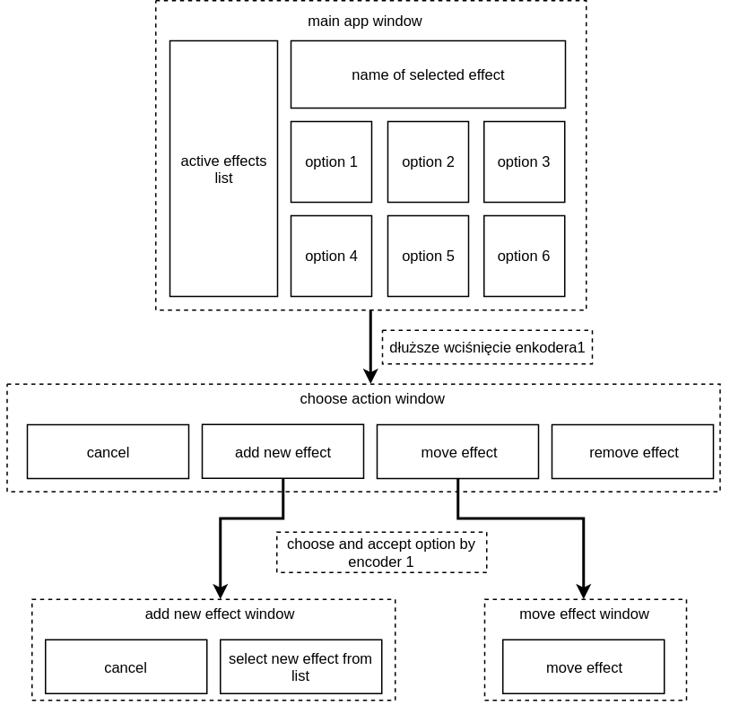
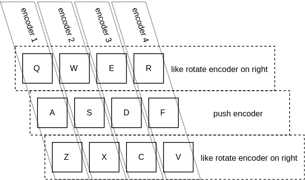
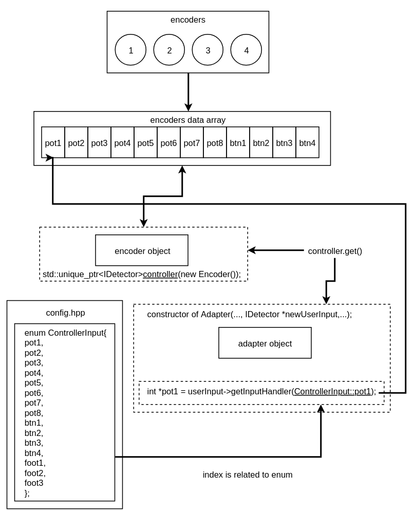

RPiGuitarFx
Copyright (C) 2018  SpeedFight

This program is free software: you can redistribute it and/or modify
it under the terms of the GNU General Public License as published by
the Free Software Foundation, either version 3 of the License, or
(at your option) any later version.

This program is distributed in the hope that it will be useful,
but WITHOUT ANY WARRANTY; without even the implied warranty of
MERCHANTABILITY or FITNESS FOR A PARTICULAR PURPOSE.  See the
GNU General Public License for more details.

You should have received a copy of the GNU General Public License
along with this program.  If not, see <http://www.gnu.org/licenses/>.